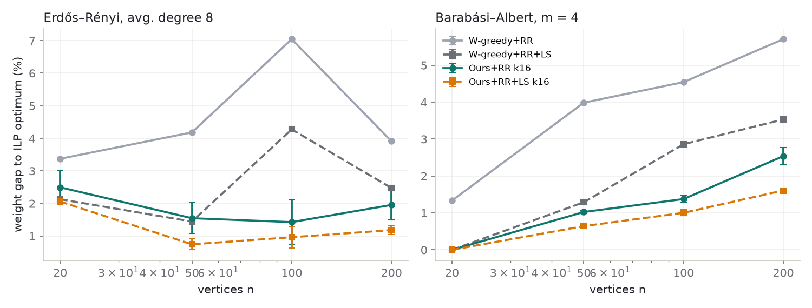
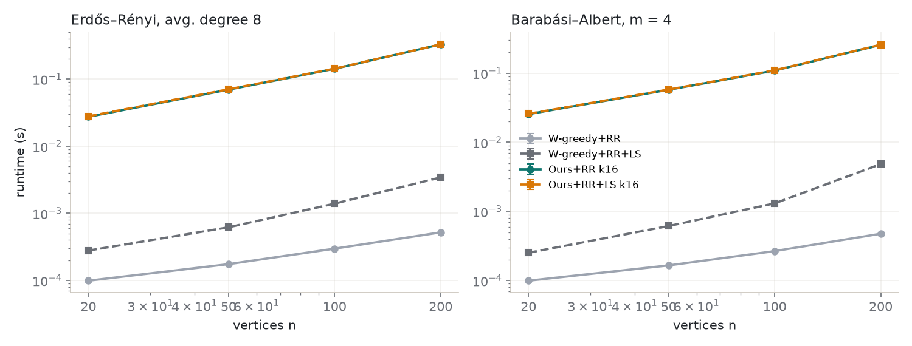
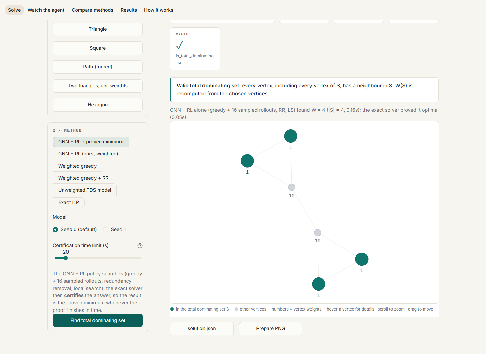
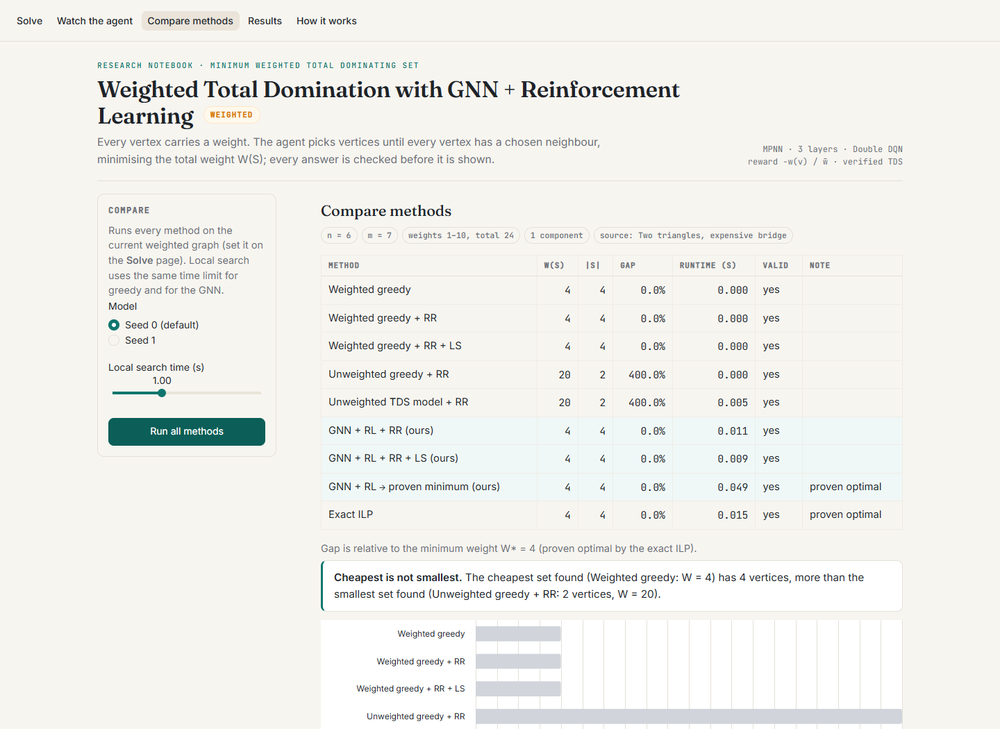
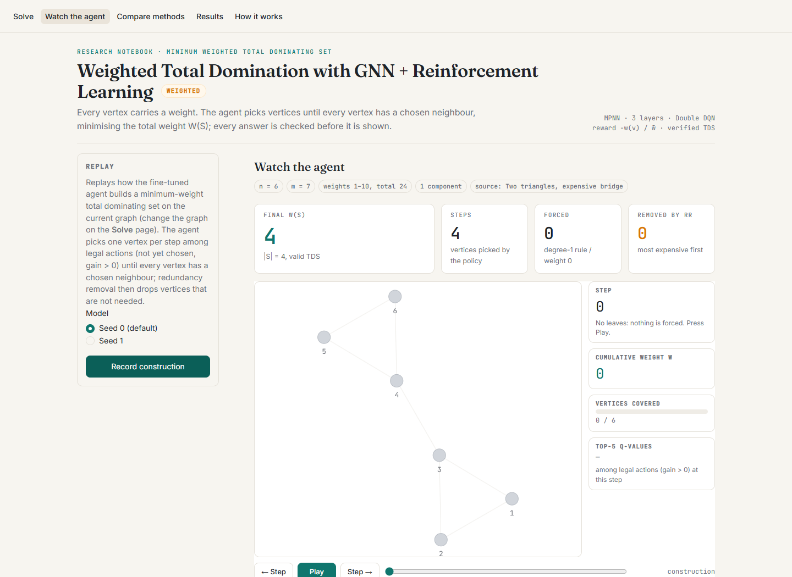
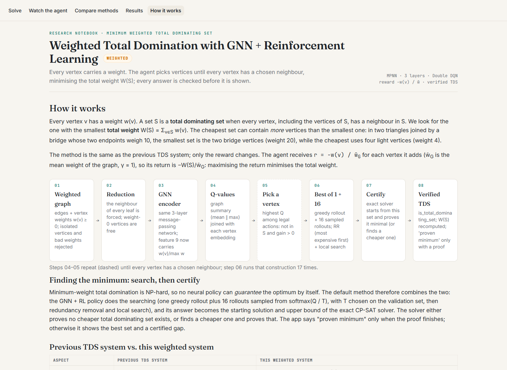

# Minimum Weighted Total Dominating Set with GNN + Deep Reinforcement Learning

This project extends our previous minimum total dominating set (TDS) system to **vertex-weighted** graphs. Following
the guide's instruction, the approach and the algorithm stay the same as the base paper and the previous TDS system.
**Only the reward changes**, so the agent minimises the total weight of the set instead of its size.

Every solution shown or reported is checked with `is_total_dominating_set`, and its weight is recomputed from the
chosen vertices. Every number below comes from a run in this folder (see
[Reproducing the results](#reproducing-the-results)).

## 1. Problem

`G = (V, E)` is undirected and simple, with vertex weights `w(v) ≥ 0`. `N(v)` is the open neighbourhood.

* `S` is a **total dominating set** iff every vertex, including the vertices of `S`, has a neighbour in `S`:
  `N(v) ∩ S ≠ ∅` for all `v`.
* **Goal:** minimise `W(S) = Σ_{v∈S} w(v)`.
* A TDS exists iff there is no isolated vertex; otherwise every solver raises `NoTotalDominatingSetError`.
  Negative, NaN or infinite weights raise `InvalidWeightError`, naming the vertex. A weight-0 vertex is free, so it
  is pre-selected.
* **Exact ILP:** `min Σ w_v x_v  s.t.  Σ_{u∈N(v)} x_u ≥ 1 ∀v, x ∈ {0,1}^n` (OR-Tools CP-SAT, or SciPy HiGHS).

**Minimum weight ≠ minimum size.** Take two triangles {1,2,3} and {4,5,6} joined by the bridge 3–4, where
w(3) = w(4) = 10 and every other vertex weighs 1. The smallest TDS is {3, 4} (2 vertices, weight 20). The cheapest is
{1, 2, 5, 6} (4 vertices, weight 4). `tests/test_weighted.py` checks this by brute force.

## 2. What changed from the TDS system

| | Previous TDS system | This weighted system |
|---|---|---|
| **Reward** | `r = −1` per chosen vertex (return `−\|S\|`) | `r = −w(v) / w̄_G`, with `w̄_G` the mean weight of the graph and γ = 1. The return is `−W(S)/w̄_G`, the objective scaled by a per-graph constant. `unit` (the old reward) remains a config option. |
| Weight feature (input 9 of 10) | always 1 | `w(v) / max w`. Same input size, **no architecture change** |
| Data | unweighted | seeded weights: `uniform_int` 1–100, `uniform_small` 1–10, `degree_correlated` deg + U{0..10}, `unit`. Training mix 50 / 20 / 30 % |
| Inputs | edges | edges + weights file, combined `v <vertex> <weight>` / `e <u> <v>` format, DIMACS `n <vertex> <weight>` lines. Missing weights default to 1 with a warning |
| Redundancy removal | by Q-value and degree | most expensive vertices first |
| Local search | 2-for-1 + plateau swaps | 2-for-1 if `w(c) < w(a)+w(b)`; 1-for-1 if `w(c) < w(a)`; only strictly improving moves |
| Baselines | greedy by gain | weighted greedy by `gain(v)/w(v)` (ties: lower w, higher degree, lower index), weighted ILP, plus the unweighted greedy and the **old TDS model** as reference points |
| Pre-selection | degree-1 rule | degree-1 rule (still exact with weights) + weight-0 vertices |
| Algorithm | 3-layer MPNN, hidden 64, mean ‖ max readout, Eq. 6-style Q head, Double DQN, action mask `gain > 0` | **unchanged**. The models are fine-tuned from the previous checkpoints |

**Why the `gain > 0` mask is still safe.** With positive weights, an optimal weighted TDS `S*` is minimal, because
dropping a redundant vertex would lower its weight. So every `v ∈ S*` has a private neighbour that only `v` covers.
Insert the forced vertices first (they belong to every TDS), then the rest of `S*` in any order. When `v` is inserted,
its private neighbour is still uncovered, so `gain(v) ≥ 1` and `v` is a legal action. The optimal set is therefore
always reachable.

## 3. Training: fine-tuning, not from scratch

The previous system's seed-0 and seed-1 checkpoints were **copied** into `checkpoints/pretrained/` and loaded with no
missing or unexpected keys. Both were then fine-tuned in parallel with the weighted reward:
* lr 5e-5, ε 0.3 → 0.05 over the first 20% of steps;
* a fresh 50k replay buffer;
* training graphs with n ∈ [20, 100], mixed families and weight distributions.

Validation runs on 100 fixed weighted graphs (n = 50–100), all optima proven by the ILP; the metric is the mean weight
gap after RR. Each seed was fine-tuned for **130,000 steps**: 80,000 steps, a pause (memory pressure on the machine),
then resumed from the saved state to 130,000. `best.pt` is the checkpoint with the lowest validation gap.

## 4. Finding the minimum: search with the GNN, then certify

The trained policy is used in three ways. Every result is a verified total dominating set.

| Method | What it does | Guarantee |
|---|---|---|
| `rl` (k = 1) | one greedy rollout of the policy, weight-aware RR, optional LS | valid TDS, usually near-minimum |
| `rl`, `samples=16` | the greedy rollout **plus** 16 rollouts sampled from softmax(Q/T), cheapest after RR, then LS. T = 0.03 was chosen on the validation set (`checkpoints/inference.json`); test sets were never used | never worse than k = 1 |
| **`rl_exact`** (app default) | the `samples=16` answer is given to the exact CP-SAT solver as its starting solution and upper bound. The solver **proves it is the minimum**, or finds a cheaper set and proves that one, within a time limit | **proven minimum** whenever the proof finishes; otherwise the best set plus a proven lower bound and gap |

The minimum-weight TDS problem is NP-hard, so no neural policy alone can *guarantee* the optimum. `rl_exact` makes the
system's answer provably minimal while the GNN + RL policy does the searching. The results below show how often the
policy's own set was already the minimum.

## Results

<!-- RESULTS:BEGIN -->
Ours and the old model: mean ± std over the 2 seeds. Greedy methods are deterministic. **2,994 reported solutions were checked with `is_total_dominating_set`: 100% valid**, and every weight was recomputed from the solution.

### Fine-tuning

| seed | fine-tuning steps | val. gap before (old model + RR) | best val. gap (ours + RR) | at step | val. gap, weighted greedy + RR |
|---|---|---|---|---|---|
| 0 | 130,000 | 47.22% | 2.78% | 120,000 | 5.38% |
| 1 | 130,000 | 40.93% | 4.31% | 94,000 | 5.38% |

MPNN, 3 layers, hidden 64, 88,129 parameters. Validation: 100 fixed weighted graphs (n = 50-100; ER, BA, WS, random geometric, lattices; weights uniform 1-100 / 1-10 / degree-correlated), all optima proven by the exact ILP. Gap = mean (W(S) - W*) / W*. Both seeds were fine-tuned for the same number of steps (80,000, then resumed to 130,000); best.pt = lowest gap after redundancy removal.

### Headline (W1: ER + BA, n = 20–200, weights 1–100)

Mean weight gap to the proven optimum on the 115 of 120 W1 instances where the ILP proved optimality (5 not proven, excluded):

| method | mean weight gap |
|---|---|
| Weighted greedy | 11.48% |
| Weighted greedy + RR | 4.27% |
| Weighted greedy + RR + LS | 2.24% |
| Unweighted greedy + RR | 78.22% |
| Old TDS model (unit reward) + RR | 75.14% ± 14.89 |
| **Ours (weighted reward) + RR** | 4.48% ± 0.61 |
| **Ours + RR + LS** | 2.19% ± 0.32 |
| **Ours + RR, best of 1+16 rollouts** | 1.53% ± 0.30 |
| **Ours + RR + LS, best of 1+16 rollouts** | 1.02% ± 0.05 |

### Finding the proven minimum

With exact certification (`method="rl_exact"`, the app's default), the returned set was **proven to be the minimum-weight TDS in 100.0%** of 410 runs (all test instances × 2 seeds); in 58.0% the GNN + RL policy's own set was already that minimum. See the 'Certified' table below.

### Certified: GNN + RL search (greedy + 16 sampled rollouts, RR, LS) whose answer warm-starts the exact CP-SAT solver, which proves it minimal or improves it (limit 20 s; 60 s for W4). 'GNN+RL alone already optimal' = the policy's own set was proven minimum. Both seeds.

| experiment | instances x seeds | proven minimum | GNN+RL alone already optimal | equals reference optimum | GNN+RL time s | certification time s |
|---|---|---|---|---|---|---|
| W1 | 240 | 100.0% | 61.7% | 100.0% | 0.13 | 0.02 |
| W2 | 160 | 100.0% | 55.6% | 100.0% | 0.14 | 0.10 |
| W3 | 8 | 100.0% | 12.5% | 100.0% | 0.68 | 0.04 |
| W4 | 2 | 100.0% | 0.0% | -- | 65.34 | 1.36 |

### W1: random graphs, weights uniform 1-100, 15 graphs per cell. Mean weight gap to the ILP optimum (%), only on instances the ILP (limit 20 s) proved optimal. Ours / old model: mean ± std over 2 seeds. LS limit 1 s for greedy and ours.

| family | n | ILP proven | W-greedy gap % | W-greedy+RR gap % | W-greedy+RR+LS gap % | U-greedy+RR gap % | Old TDS model+RR gap % | Ours+RR gap % | Ours+RR+LS gap % | Ours+RR k16 gap % | Ours+RR+LS k16 gap % |
|---|---|---|---|---|---|---|---|---|---|---|---|
| BA | 20 | 15/15 | 9.82 | 1.33 | 0.00 | 46.48 | 62.27 ± 24.53 | 2.14 ± 3.03 | 0.28 ± 0.40 | 0.00 ± 0.00 | 0.00 ± 0.00 |
| BA | 50 | 15/15 | 10.15 | 3.99 | 1.29 | 65.17 | 62.62 ± 15.02 | 2.66 ± 0.67 | 1.26 ± 0.28 | 1.03 ± 0.04 | 0.64 ± 0.00 |
| BA | 100 | 15/15 | 10.35 | 4.54 | 2.86 | 67.35 | 59.28 ± 5.18 | 4.63 ± 3.53 | 2.80 ± 2.40 | 1.38 ± 0.10 | 1.00 ± 0.08 |
| BA | 200 | 15/15 | 12.85 | 5.71 | 3.53 | 61.53 | 63.91 ± 16.00 | 5.83 ± 0.11 | 3.59 ± 0.05 | 2.54 ± 0.23 | 1.61 ± 0.04 |
| ER | 20 | 15/15 | 11.50 | 3.37 | 2.13 | 122.78 | 100.07 ± 29.67 | 4.86 ± 2.10 | 2.13 ± 0.00 | 2.50 ± 0.52 | 2.06 ± 0.10 |
| ER | 50 | 15/15 | 12.01 | 4.18 | 1.45 | 83.06 | 90.28 ± 15.39 | 6.16 ± 1.18 | 2.36 ± 0.26 | 1.55 ± 0.47 | 0.75 ± 0.17 |
| ER | 100 | 15/15 | 13.33 | 7.04 | 4.27 | 88.20 | 76.04 ± 8.00 | 4.35 ± 0.32 | 2.66 ± 0.43 | 1.43 ± 0.68 | 0.96 ± 0.33 |
| ER | 200 | 10/15 | 12.05 | 3.91 | 2.48 | 97.69 | 92.41 ± 0.59 | 5.62 ± 1.72 | 2.53 ± 0.11 | 1.96 ± 0.46 | 1.18 ± 0.13 |





### W2: n = 100, each weight distribution, 10 graphs each. Weight gap to the proven ILP optimum (%). k16 = best of the greedy rollout and 16 sampled rollouts (temperature chosen on validation).

| family | weights | ILP proven | W-greedy+RR gap % | Old TDS model+RR gap % | Ours+RR gap % | Ours+RR k16 gap % |
|---|---|---|---|---|---|---|
| BA | degree_correlated | 10/10 | 16.99 | 21.95 ± 1.89 | 6.38 ± 0.40 | 2.85 ± 0.46 |
| BA | uniform_int | 10/10 | 4.44 | 56.27 ± 5.97 | 6.40 ± 2.11 | 2.13 ± 0.90 |
| BA | uniform_small | 10/10 | 7.74 | 43.50 ± 11.59 | 5.54 ± 1.03 | 1.44 ± 0.98 |
| BA | unit | 10/10 | 9.44 | 3.98 ± 2.27 | 9.25 ± 0.73 | 3.21 ± 1.19 |
| ER | degree_correlated | 1/10 | 18.54 | 20.98 ± 6.21 | 9.51 ± 7.93 | 0.49 ± 0.00 |
| ER | uniform_int | 10/10 | 6.89 | 83.86 ± 0.69 | 5.71 ± 1.18 | 0.82 ± 0.17 |
| ER | uniform_small | 10/10 | 6.31 | 60.88 ± 7.17 | 6.33 ± 0.94 | 1.37 ± 0.03 |
| ER | unit | 7/10 | 10.56 | 7.46 ± 3.05 | 12.67 ± 3.19 | 4.41 ± 1.26 |

### W3: lattices with weights uniform 1-100 (zero-shot sizes). Total weight W(S); ours: mean ± std over seeds.

| lattice | n | ILP W* | W-greedy | W-greedy+RR | W-greedy+RR+LS | U-greedy+RR | Old TDS model+RR | Ours+RR | Ours+RR+LS | Ours+RR k16 | Ours+RR+LS k16 |
|---|---|---|---|---|---|---|---|---|---|---|---|
| grid | 100 | 1208 | 1275.0 | 1258.0 | 1258.0 | 2026.0 | 1659.5 ± 227.0 | 1234.5 ± 27.6 | 1230.5 ± 21.9 | 1222.5 ± 20.5 | 1222.5 ± 20.5 |
| grid | 400 | 3838 | 4254.0 | 3978.0 | 3864.0 | 6703.0 | 5097.0 ± 500.6 | 4026.5 ± 74.2 | 3933.5 ± 2.1 | 3979.5 ± 36.1 | 3913.0 ± 33.9 |
| tri | 100 | 1039 | 1209.0 | 1167.0 | 1074.0 | 1687.0 | 1434.0 ± 251.7 | 1079.0 ± 33.9 | 1069.5 ± 20.5 | 1070.0 ± 21.2 | 1058.0 ± 4.2 |
| tri | 400 | 2378 | 2567.0 | 2456.0 | 2385.0 | 5123.0 | 3417.0 ± 558.6 | 2440.5 ± 13.4 | 2407.5 ± 12.0 | 2430.5 ± 21.9 | 2412.5 ± 4.9 |

### W4: one Barabási–Albert graph, n = 5,000, m = 3, weights uniform 1-100.

| method | W(S) | |S| | time s |
|---|---|---|---|
| W-greedy | 26976.0 | 1033.0 | 0.01 |
| W-greedy+RR | 25683.0 | 876.0 | 0.01 |
| Ours+RR | 25412.0 ± 234.8 | 829.5 ± 6.4 | 0.95 ± 0.01 |

**Data separation:** 37,323 training-graph seeds checked; 100 validation seeds; 205 test seeds. Overlaps: train–val 0, train–test 0, val–test 0.
<!-- RESULTS:END -->

## How to run

```powershell
cd "D:\project s7\wtds-gnn-rl"
.venv\Scripts\Activate.ps1          # cmd: .venv\Scripts\activate.bat
streamlit run app/streamlit_app.py  # app at http://localhost:8501
```

The app has five pages:
* **Solve:** examples, generate, upload or paste a weighted graph; five methods; W(S) as the main number.
* **Watch the agent:** step replay with each vertex's weight and the cumulative weight.
* **Compare methods**
* **Results**
* **How it works**

The app runs on CPU and uses the GPU when available.

| Solve | Compare methods |
|---|---|
|  |  |
| **Watch the agent** | **How it works** |
|  |  |

```powershell
python -m wtds.solve --graph edges.txt --weights weights.txt --method rl --out solution.json --plot solution.png
python -m pytest -q
```

```python
from wtds import solve
res = solve(G, weights, method="rl", checkpoint="checkpoints/best.pt", rr=True, ls_time=1.0)
res.vertices, res.weight, res.size, res.runtime, res.is_valid      # is_valid always verified
```

Methods: `rl_exact` (GNN + RL, certified minimum), `rl` (use `samples=16` for best-of-k), `old_tds_model`, `greedy`
(weighted), `greedy_rr`, `greedy_rr_ls`, `unweighted_greedy_rr`, `ilp`.
`weights` may be `None`, a dict `{vertex: w}`, a list of n weights, or a weights file.

## Reproducing the results

```powershell
python -m wtds.train --config configs/default.yaml --seed 0 --resume   # fine-tune (both seeds in parallel)
python -m wtds.train --config configs/default.yaml --seed 1 --resume
python scripts/finalize_models.py                                      # checkpoints/best.pt, seed1_best.pt, model_info.json
python scripts/tune_inference.py                                       # sampling temperature, on the VALIDATION set
python scripts/run_final.py sets; python scripts/run_final.py ilp
python scripts/run_final.py timed; python scripts/run_final.py exact  # run on an idle machine
python scripts/run_final.py report
python scripts/readme_results.py
```

**To extend later:**
* **Longer fine-tuning:** raise `train.total_steps` and resume. `runs/wtds_seed*/resume.pt` continues from step 80,000.
* **More seeds:** `--seed 2` uses `checkpoints/pretrained/tds_seed2_best.pt`; copy one in first, or set `train.init_checkpoint`.
* **Larger experiments:** edit the sizes and counts in `scripts/run_final.py`.

## Limitations

* **Short fine-tuning, 2 seeds.** Each seed was fine-tuned for 130,000 steps from the previous TDS checkpoints.
  Results are mean ± std over these 2 seeds only.
* **Optimality is proven by the exact solver, not by the network.** `rl_exact` returns a proven minimum only when
  CP-SAT finishes its proof within the time limit. On large or dense graphs it may stop with a lower bound instead;
  the app and API then report the certified gap rather than claiming optimality.
* **A single greedy rollout is not enough on uniform weights.** With k = 1 our policy + RR is about level with
  weighted greedy + RR on W1; the clear gains come from best-of-(1+16) rollouts and from local search (see the tables).
  On lattices (W3), local search matters more than sampling. On unit weights the old unit-reward model is competitive,
  as expected.
* **Certification speed is not a controlled comparison.** The certified runs (`rl_exact`) proved every test instance
  optimal, including some the standalone 20 s ILP reference did not prove. But the certified runs used 8 solver threads,
  one job at a time, while the reference ran 3 jobs × 4 threads in parallel, so the speed-up cannot be attributed to
  the GNN warm start alone.
* **Reduced experiments.** n ≤ 200 for W1/W2, lattices up to about 400 vertices, and one 5,000-vertex BA graph. The ILP
  ran with a 20 s limit; instances without a proof of optimality are excluded from gaps and counted in the tables
  (W2 ER degree-correlated: 1/10 proven).
* **No separate reward-ablation training.** The previous unit-reward TDS model, applied to weighted graphs with the same
  weighted redundancy removal, serves as the reward ablation.
* **No comparison with published weighted-total-domination metaheuristics**, and no real benchmark instances.
* **Sampling temperature** (0.03) was chosen on the validation set from {0.03, 0.1, 0.3, 1.0} with k = 16;
  other k values were not tuned.

## References

* M. Chen, S. Liu, W. He (2024). *Learn to solve dominating set problem with GNN and reinforcement learning.*
  Applied Mathematics and Computation 474:128717. (base paper)
* Our previous minimum total dominating set system (GNN + Double DQN), `D:\project s7\tds-gnn-rl`: the starting
  point, whose checkpoints are fine-tuned here. It was not modified; see `docs/original_hashes_*.txt`.
